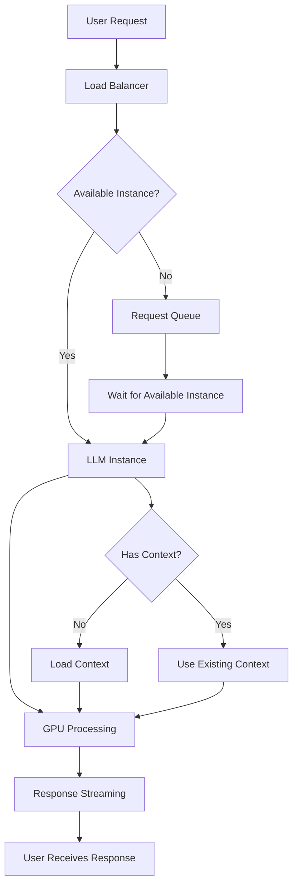
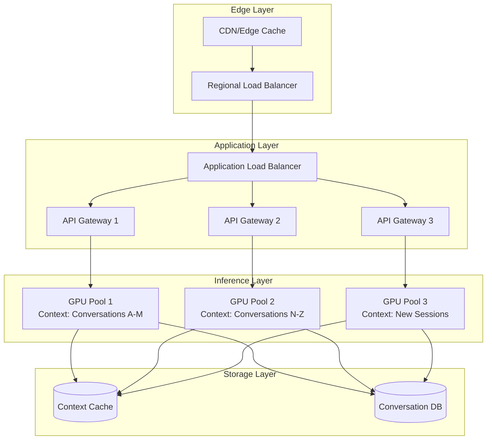
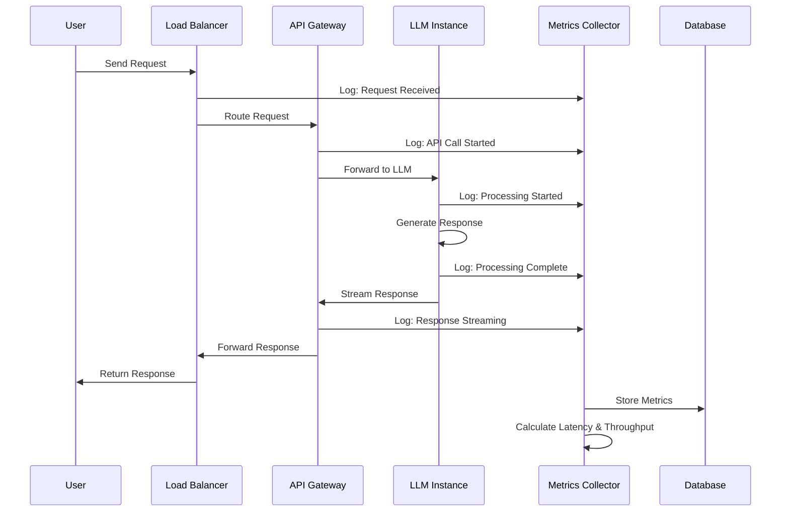

Large Language Models (LLMs) have revolutionized how we interact with AI, but behind the scenes, there's a complex web of networking patterns that make these systems work at scale. Today, I want to explore how LLMs like Claude, GPT-4, and others handle networking challenges and what we can learn from their architectures.

## The Challenge of Scale

When millions of users interact with an LLM simultaneously, the networking infrastructure becomes critical. Unlike traditional web applications, LLM inference has unique characteristics:

- **Variable response times** - Simple queries return quickly, while complex reasoning tasks take longer
- **Stateful conversations** - Context must be maintained across multiple requests
- **Resource-intensive processing** - Each request requires significant GPU computation

Here's a high-level view of how LLM requests flow through a typical infrastructure:



Let's look at a simplified example of how we might implement request routing for an LLM service:

```typescript
interface LLMRequest {
  prompt: string;
  conversationId?: string;
  maxTokens: number;
  temperature: number;
}

class LLMLoadBalancer {
  private readonly instances: LLMInstance[];
  private readonly requestQueue: Map<string, LLMRequest[]>;

  constructor(instances: LLMInstance[]) {
    this.instances = instances;
    this.requestQueue = new Map();
  }

  async routeRequest(request: LLMRequest): Promise<string> {
    // Find the least loaded instance
    const instance = this.findOptimalInstance(request);

    // Queue the request if all instances are busy
    if (!instance.isAvailable()) {
      return this.queueRequest(request);
    }

    return instance.processRequest(request);
  }

  private findOptimalInstance(request: LLMRequest): LLMInstance {
    // Prefer instances that already have this conversation's context
    if (request.conversationId) {
      const contextInstance = this.instances.find(instance =>
        instance.hasContext(request.conversationId!)
      );
      if (contextInstance?.isAvailable()) {
        return contextInstance;
      }
    }

    // Fallback to least loaded instance
    return this.instances.reduce((best, current) =>
      current.getCurrentLoad() < best.getCurrentLoad() ? current : best
    );
  }
}
```

## Optimizing API Communication

One fascinating aspect of LLM networking is how streaming responses are handled. Unlike traditional REST APIs that return complete responses, LLMs often stream tokens as they're generated:

```python
import asyncio
import aiohttp
from typing import AsyncGenerator

class StreamingLLMClient:
    def __init__(self, api_url: str, api_key: str):
        self.api_url = api_url
        self.api_key = api_key

    async def stream_completion(
        self,
        prompt: str,
        **kwargs
    ) -> AsyncGenerator[str, None]:
        headers = {
            "Authorization": f"Bearer {self.api_key}",
            "Content-Type": "application/json"
        }

        payload = {
            "prompt": prompt,
            "stream": True,
            **kwargs
        }

        async with aiohttp.ClientSession() as session:
            async with session.post(
                f"{self.api_url}/completions",
                headers=headers,
                json=payload
            ) as response:
                async for line in response.content:
                    if line.startswith(b"data: "):
                        try:
                            data = json.loads(line[6:])
                            if token := data.get("token"):
                                yield token
                        except json.JSONDecodeError:
                            continue

# Usage example
async def main():
    client = StreamingLLMClient("https://api.example.com", "your-api-key")

    async for token in client.stream_completion(
        "Explain quantum computing in simple terms"
    ):
        print(token, end="", flush=True)
```

## Network Performance Considerations

The network topology for LLM services often looks like this, with multiple layers of optimization:



### 1. Connection Pooling

LLM services benefit greatly from connection pooling since conversations often involve multiple back-and-forth exchanges:

```go
package main

import (
    "net/http"
    "time"
)

type LLMClient struct {
    httpClient *http.Client
    baseURL    string
    apiKey     string
}

func NewLLMClient(baseURL, apiKey string) *LLMClient {
    // Configure transport for optimal performance
    transport := &http.Transport{
        MaxIdleConns:        100,
        MaxIdleConnsPerHost: 20,
        IdleConnTimeout:     90 * time.Second,
        DisableCompression:  false,
    }

    return &LLMClient{
        httpClient: &http.Client{
            Transport: transport,
            Timeout:   120 * time.Second, // LLM requests can be slow
        },
        baseURL: baseURL,
        apiKey:  apiKey,
    }
}
```

### 2. Request Batching

For scenarios where you need to process multiple prompts, batching can significantly improve throughput:

```rust
use tokio::time::{sleep, Duration};
use std::collections::VecDeque;

struct BatchProcessor {
    batch_size: usize,
    batch_timeout: Duration,
    queue: VecDeque<Request>,
}

impl BatchProcessor {
    pub async fn process_batch(&mut self) -> Vec<Response> {
        let mut batch = Vec::new();
        let start_time = std::time::Instant::now();

        // Collect requests until batch is full or timeout is reached
        while batch.len() < self.batch_size {
            if let Some(request) = self.queue.pop_front() {
                batch.push(request);
            } else if start_time.elapsed() > self.batch_timeout {
                break;
            } else {
                sleep(Duration::from_millis(10)).await;
            }
        }

        if batch.is_empty() {
            return Vec::new();
        }

        // Process the entire batch in one API call
        self.send_batch_request(batch).await
    }

    async fn send_batch_request(&self, requests: Vec<Request>) -> Vec<Response> {
        // Implementation would send all requests in a single API call
        // This reduces network overhead and can improve GPU utilization
        todo!("Implement batch API call")
    }
}
```

## Monitoring and Observability

Understanding LLM networking performance requires careful monitoring. Here's how a typical request flows through the monitoring system:



Here's a simple metrics collection system:

```typescript
interface NetworkMetrics {
  totalRequests: number;
  averageLatency: number;
  errorRate: number;
  tokensPerSecond: number;
}

class LLMMetricsCollector {
  private metrics: Map<string, number[]> = new Map();

  recordRequest(endpoint: string, latency: number, success: boolean) {
    const key = `${endpoint}_latency`;
    if (!this.metrics.has(key)) {
      this.metrics.set(key, []);
    }
    this.metrics.get(key)!.push(latency);

    // Record success/failure
    const successKey = `${endpoint}_success`;
    if (!this.metrics.has(successKey)) {
      this.metrics.set(successKey, []);
    }
    this.metrics.get(successKey)!.push(success ? 1 : 0);
  }

  getMetrics(endpoint: string): NetworkMetrics {
    const latencies = this.metrics.get(`${endpoint}_latency`) || [];
    const successes = this.metrics.get(`${endpoint}_success`) || [];

    return {
      totalRequests: latencies.length,
      averageLatency: latencies.reduce((a, b) => a + b, 0) / latencies.length,
      errorRate: 1 - successes.reduce((a, b) => a + b, 0) / successes.length,
      tokensPerSecond: this.calculateTokensPerSecond(endpoint),
    };
  }

  private calculateTokensPerSecond(endpoint: string): number {
    // Implementation would track tokens generated per time unit
    return 0; // Placeholder
  }
}
```

## Key Takeaways

After analyzing various LLM networking patterns, several key insights emerge:

1. **Streaming is essential** - Users expect immediate feedback, even for long-running tasks
2. **Context affinity matters** - Routing requests to instances that already have conversation context improves performance
3. **Connection reuse is critical** - The overhead of establishing new connections becomes significant at scale
4. **Monitoring is complex** - Traditional web metrics don't capture the unique characteristics of LLM workloads

## Looking Forward

As LLMs continue to evolve, we're seeing interesting developments in networking patterns:

- **Edge deployment** - Moving inference closer to users
- **Hybrid models** - Combining local and cloud processing
- **Specialized protocols** - Moving beyond HTTP for LLM-specific optimizations

The networking challenges of LLMs are pushing us to rethink traditional approaches to distributed systems, and I'm excited to see what innovations emerge.

> **Note**: The code examples above are simplified for illustration purposes. Production LLM systems involve additional complexity around authentication, rate limiting, safety checks, and more.

---

_What are your thoughts on LLM networking challenges? Have you encountered interesting patterns in your own work with AI systems? I'd love to hear about your experiences!_
